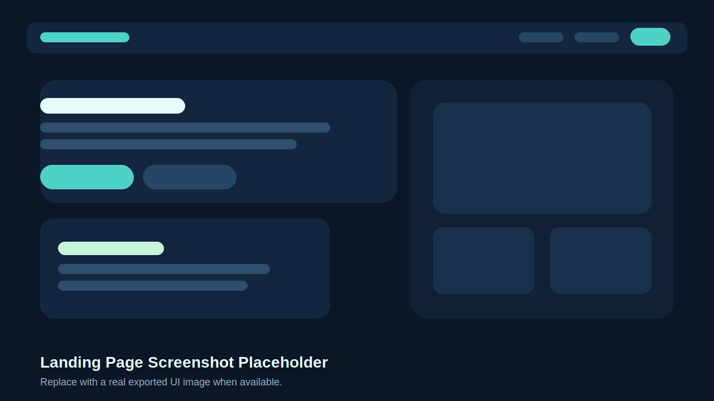
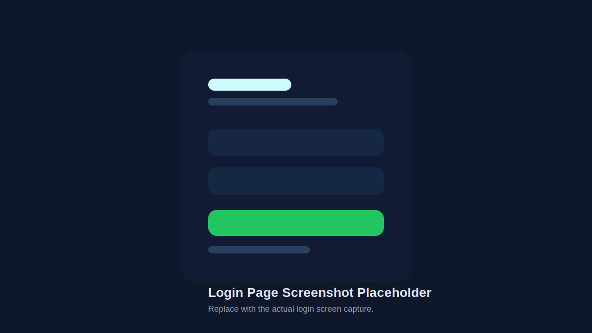
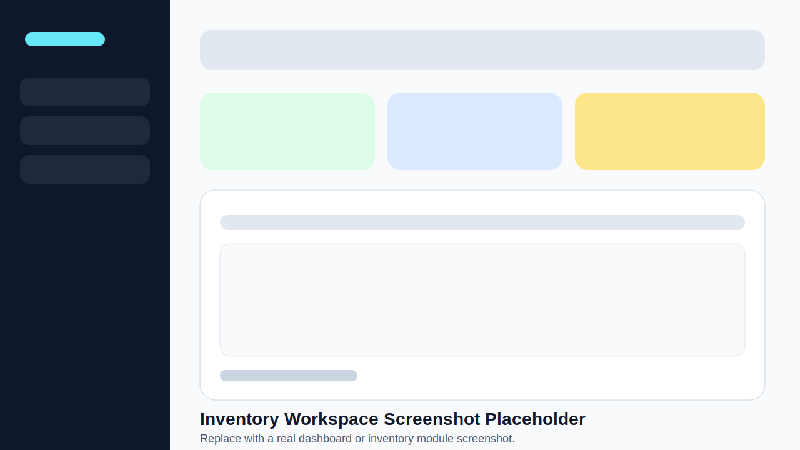

# PharmacyERP

PharmacyERP is a full-stack pharmacy management system built for inventory control, item management, stock intake, audit visibility, and AI-assisted analysis.

> [!IMPORTANT]
> This project is still under active development. Some modules are incomplete, some integrations are still being stabilized, and production readiness work is ongoing.

## Overview

The application combines a React frontend with a Django backend to support day-to-day pharmacy operations. Based on the current codebase, the main implemented areas include:

- Landing page and authentication flow
- Dashboard
- Inventory hub and inventory control
- Item master and item grouping
- Batch details
- Stock entry and stock-in item workflows
- Audit logs
- AI insights

The following routes are currently marked in the app as under construction:

- Manufacturing
- Quality Control
- Sales

## Screenshots

These are temporary local preview placeholders included in the repository so the README renders cleanly. Replace them with actual UI screenshots when you export them from the running app.

### Landing Page



### Login Page



### Inventory Workspace



## Tech Stack

### Frontend

- React 19
- TypeScript
- Vite
- Tailwind CSS 4
- React Router
- TanStack React Query
- Axios
- Recharts
- Lucide React

### Backend

- Python
- Django
- Django REST Framework
- Simple JWT
- django-cors-headers
- PostgreSQL
- python-dotenv

### AI / Analytics

- Google GenAI SDK (`@google/genai`)

## Project Structure

```text
PharmacyERP/
├── back/                     # Django backend
│   ├── pharmacy_erp/
│   └── requirements.txt
├── front/                    # React + Vite frontend
│   ├── src/
│   └── package.json
├── docs/
│   └── screenshots/
└── DATABASE_SCHEMA.md
```

## Getting Started

### Prerequisites

- Node.js and npm
- Python 3
- PostgreSQL

### Frontend

```bash
cd front
npm install
npm run dev
```

### Backend

```bash
cd back
python -m venv venv
venv\Scripts\activate
pip install -r requirements.txt
cd pharmacy_erp
python manage.py migrate
python manage.py runserver
```

## Environment Notes

### Frontend

The frontend includes an example environment file:

```env
GEMINI_API_KEY=PLACEHOLDER_API_KEY
```

The codebase also currently contains a hardcoded local API base URL in the frontend service layer, so deployment configuration is still being finalized.

### Backend

The backend expects PostgreSQL connection values from environment variables:

- `DB_NAME`
- `DB_USER`
- `DB_PWD`
- `DB_HOST`
- `DB_PORT`

## Current Status

- Core inventory-related flows are present in the codebase
- AI-assisted analysis is integrated on the frontend
- Several ERP modules are still under construction
- Configuration and deployment hardening are still in progress

## Notes

- See `DATABASE_SCHEMA.md` for the current database design reference
- Replace the files in `docs/screenshots/` with real screenshots when available
